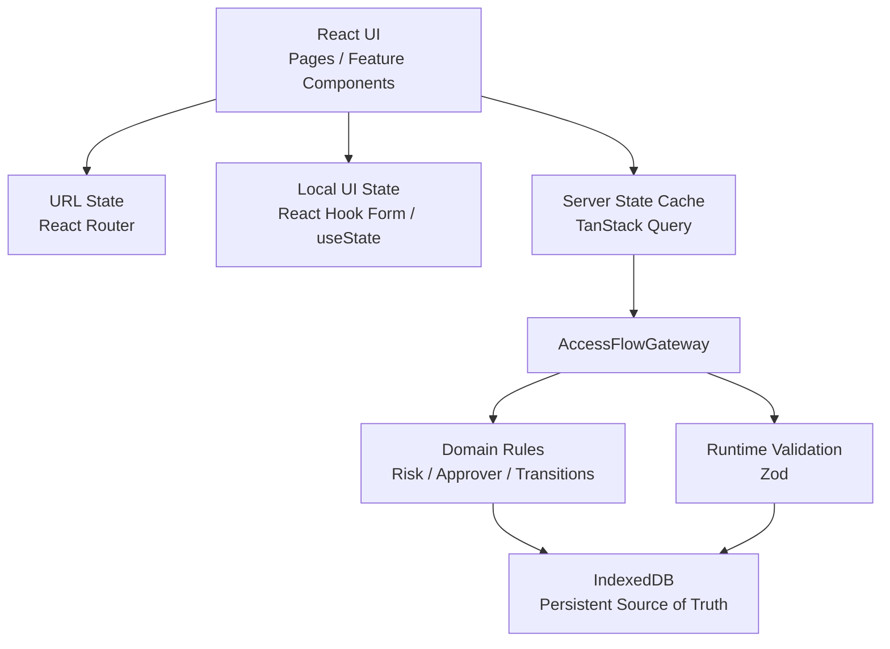
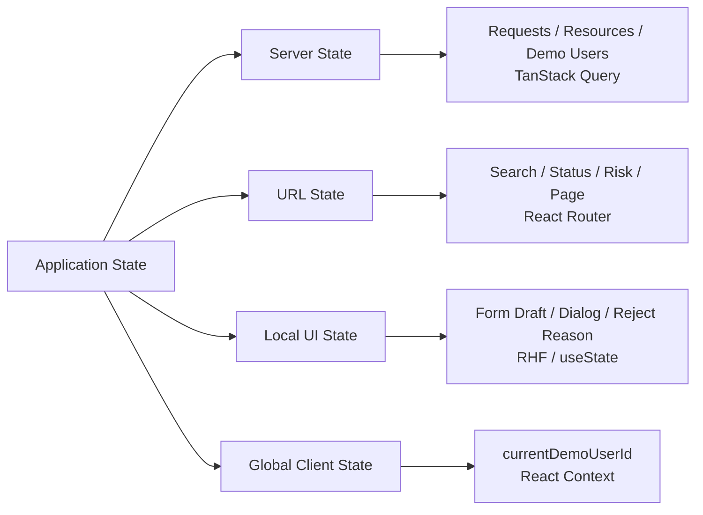
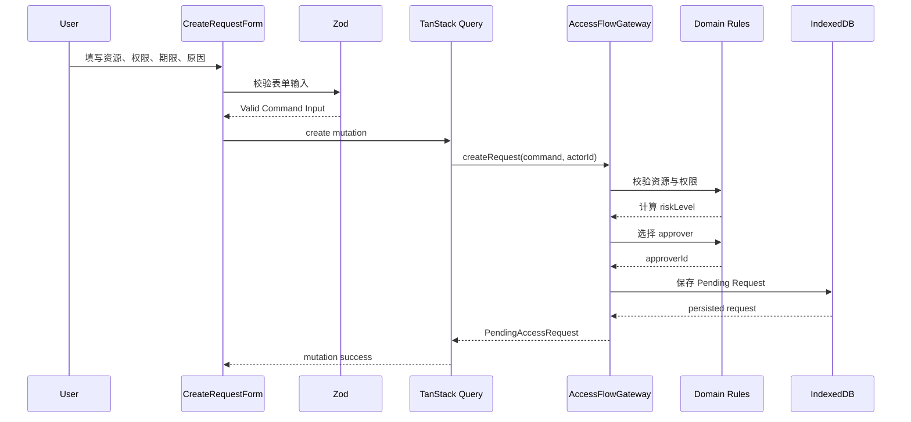
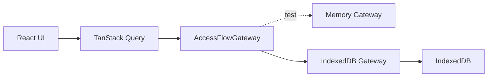
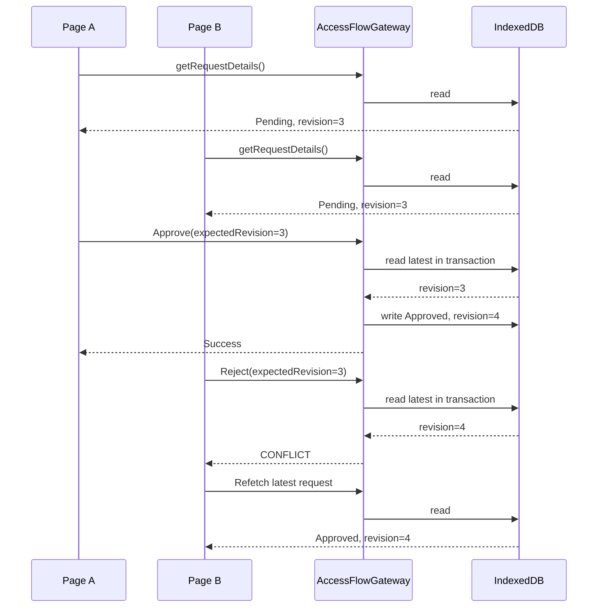

# AccessFlow

一个基于 React + TypeScript 构建的企业内部访问权限申请与审批系统。

AccessFlow 用于模拟企业员工申请系统、项目、数据资源等访问权限的完整流程，覆盖申请创建、查询筛选、详情查看、审批、状态追踪及并发审批冲突处理。

本项目不仅关注页面功能实现，也重点实践了：

* 严格的 TypeScript 领域建模
* Server State / URL State / Local State 的状态边界
* Gateway 数据访问抽象
* IndexedDB 本地持久化
* Optimistic Concurrency Control
* 行为导向测试
* Accessibility
* 基于真实浏览器的性能验收
* GitHub Spec Kit + Codex CLI 驱动的 Spec-Driven Development

---

## 项目预览

> 在线 Demo：待部署

> 项目截图：待补充

核心业务流程：

```text
创建权限申请
      ↓
进入 Pending
      ↓
搜索 / 筛选申请
      ↓
查看申请详情
      ↓
切换到负责审批员工
      ↓
Approve / Reject
      ↓
形成最终审批记录
      ↓
申请人查看最终结果
```

---

## 核心功能

### 权限申请

员工可以创建新的权限申请，包括：

* 目标资源
* 权限级别
* 访问截止日期
* 申请原因

申请创建后：

* 风险等级由领域规则计算
* 审批人由资源的审批候选人规则确定
* 初始状态自动设置为 `Pending`
* 业务数据持久化到 IndexedDB

UI 不允许直接提交：

* `riskLevel`
* `approverId`
* `status`
* `revision`

这些字段均由 Domain / Gateway 决定。

### 申请列表

支持：

* 按申请人或资源名称搜索
* 按申请状态筛选
* 按风险等级筛选
* 分页
* Loading / Empty / Error / Success 状态
* High Risk 非纯颜色提示

列表查询状态全部由 URL 表达：

```text
/requests?q=database&status=Pending&risk=High&page=2
```

因此支持：

* 页面刷新恢复
* 浏览器前进 / 后退
* URL 分享
* 查询状态可重现

### 申请详情

详情页面支持直接访问：

```text
/requests/:requestId
```

展示：

* 申请人
* 审批人
* 目标资源
* 权限
* 访问期限
* 申请原因
* 风险等级
* 当前状态
* 创建时间
* 审批记录

不存在的申请和当前员工无权查看的申请统一返回相同的不可用状态，避免泄露资源存在性。

### 审批流程

负责审批的员工可以处理分配给自己的 `Pending` 申请：

```text
Pending
   │
   ├── Approve
   │      ↓
   │   Approved
   │
   └── Reject(reason)
          ↓
       Rejected
```

业务规则包括：

* 申请人不能审批自己的申请
* 只有指定 `approverId` 可以审批
* Reject 必须填写原因
* 已过期申请不可 Approve，但可以 Reject
* `Approved` / `Rejected` 为最终状态
* 同一申请只能形成一条有效最终审批记录

---

## 技术栈

| 分类                  | 技术                          |
| ------------------- | --------------------------- |
| UI                  | React 19                    |
| Language            | TypeScript 6 strict         |
| Build               | Vite 8                      |
| Routing             | React Router                |
| Server State        | TanStack Query              |
| Form                | React Hook Form             |
| Runtime Validation  | Zod                         |
| Styling             | Tailwind CSS 4              |
| Persistence         | IndexedDB + idb             |
| Unit / Integration  | Vitest                      |
| Component Testing   | React Testing Library       |
| Browser E2E         | Playwright                  |
| Development Process | GitHub Spec Kit + Codex CLI |

---

## 架构设计

```text
┌─────────────────────────────────────┐
│              React UI               │
│                                     │
│ Pages / Feature Components          │
└──────────────────┬──────────────────┘
                   │
        ┌──────────┼──────────┐
        │          │          │
        ↓          ↓          ↓
   URL State   Local State  Server State
 React Router  RHF/useState  TanStack Query
                              │
                              ↓
                    AccessFlowGateway
                              │
                   ┌──────────┴─────────┐
                   ↓                    ↓
               Domain Rules          Zod
                   │                    │
                   └──────────┬─────────┘
                              ↓
                          IndexedDB
```

核心依赖方向：

```text
UI
↓
Query / Gateway
↓
Domain
↓
Persistence
```

Domain 层不依赖 React、Router、TanStack Query 或 IndexedDB。

---
## Architecture

AccessFlow 采用清晰的分层结构，将 UI、状态管理、业务规则与持久化职责分离。

核心原则是：

* React UI 不直接访问 IndexedDB
* TanStack Query 只负责 Server State 缓存，不作为持久化事实来源
* 业务规则集中在 Domain 层
* 持久化访问统一通过 `AccessFlowGateway`
* URL、Local UI State、Server State 和 Global Client State 各自拥有明确的生命周期

整体依赖方向如下：



### Dependency Direction

```text
Pages / Feature Components
          │
          ├── URL State ───────── React Router
          │
          ├── Local UI State ──── React Hook Form / useState
          │
          └── Server State ────── TanStack Query
                                      │
                                      ↓
                              AccessFlowGateway
                                      │
                          ┌───────────┴───────────┐
                          ↓                       ↓
                    Domain Rules           Zod Boundaries
                          │                       │
                          └───────────┬───────────┘
                                      ↓
                                  IndexedDB
```

`domain` 层不依赖 React、React Router、TanStack Query 或 IndexedDB 实现。

这使业务规则可以独立测试，也避免 UI 与具体持久化方案耦合。

---

## State Ownership

AccessFlow 没有引入 Redux 或 Zustand，而是根据状态的真实归属和生命周期选择状态容器。



### Server State

由 TanStack Query 管理：

* Demo Users
* Resource Catalog
* Access Request List
* Access Request Detail
* 创建申请结果
* 审批结果

TanStack Query 只负责缓存和异步生命周期。

真正的业务事实来源是：

```text
IndexedDB
```

即使 Query Cache 被清空，页面仍然可以通过 Gateway 从 IndexedDB 恢复数据。

### URL State

以下已提交查询状态由 URL 表达：

* `q`
* `status`
* `risk`
* `page`

例如：

```text
/requests?q=database&status=Pending&risk=High&page=2
```

因此列表天然支持：

* 页面刷新恢复
* 浏览器前进 / 后退
* URL 分享
* 查询状态重现

URL 是已提交查询状态的唯一来源，不再复制到 Context 或额外的 React State。

### Local UI State

短生命周期交互状态保留在最近的组件中，例如：

* 搜索输入草稿
* 创建申请表单
* Reject Dialog
* 拒绝原因
* Modal 开关

这些状态离开对应交互后即可销毁，因此不进入全局状态。

### Global Client State

AccessFlow 只有一个必要的全局 Client State：

```text
currentDemoUserId
```

使用 React Context 管理。

完整 `DemoUser` 对象仍通过 Gateway + TanStack Query 获取，避免形成第二份 Server State。

---

## Data Flow

以“创建权限申请”为例，完整数据流如下：



UI 只能提交：

```text
resourceId
permission
expiresAt
reason
```

以下业务字段不能由 UI 决定：

```text
riskLevel
approverId
status
revision
```

它们必须由 Domain / Gateway 计算并返回。

这样可以避免 UI 成为第二套业务规则实现。

---

## Domain Boundary

AccessFlow 使用判别联合描述申请状态：

```text
AccessRequest
│
├── Pending
│   └── approvalRecord = null
│
├── Approved
│   └── approvalRecord = ApprovedRecord
│
└── Rejected
    └── approvalRecord = RejectedRecord
        └── rejectionReason
```

这使以下非法状态无法被正常表达：

```text
status = Pending
rejectionReason = "审批拒绝"
```

TypeScript 负责编译期合法状态约束。

Zod 负责运行时边界，例如：

```text
URL
Form
IndexedDB
Seed Data
Gateway Return Value
```

因此整体边界可以理解为：

```text
Untrusted Data
      ↓
     Zod
      ↓
Trusted Domain Model
      ↓
Business Rules
      ↓
Application
```

---

## Gateway Boundary

React UI 不直接操作 IndexedDB。



项目同时实现：

```text
MemoryGateway
IndexedDBGateway
```

两种实现运行同一套 Gateway Contract Tests。

Gateway 对 UI 暴露的是业务能力：

```text
listRequests
getRequestDetails
createRequest
approveRequest
rejectRequest
resetDemoData
```

而不是：

```text
getStore
putDocument
readObjectStore
```

因此持久化实现不会泄漏到 UI。

如果未来将 IndexedDB 替换为真实 HTTP API，主要变化可以控制在 Gateway Adapter 层。

---

## Optimistic Concurrency Control

AccessFlow 的审批操作具有以下特点：

* 不可逆
* 只能产生一个最终结果
* 可能存在多个 stale client 同时处理同一申请

因此每条申请包含：

```text
revision
```

客户端执行审批时必须携带：

```text
expectedRevision
```

例如两个页面同时读取：

```text
Request:
status = Pending
revision = 3
```

并发流程如下：



最终状态：

```text
Page A
Approve
↓
Success
↓
revision = 4


Page B
Reject(expectedRevision = 3)
↓
CONFLICT
↓
不自动 retry
↓
Refetch
↓
展示 Approved 最终状态
```

审批 mutation 不进行 optimistic update，也不会在 `CONFLICT` 后自动重试原决定。

原因是自动 retry 可能改变用户原本基于旧数据作出的业务意图。

因此 AccessFlow 使用：

```text
Conservative Mutation
+
Optimistic Concurrency Control
```

而不是：

```text
Optimistic UI Update
```

---

## Architecture Principles

AccessFlow 的整体架构遵循以下原则：

```text
UI 不拥有业务事实

Query Cache 不等于持久化数据

URL 是可导航查询状态的唯一来源

Local State 保持最小生命周期

Domain Rules 不复制到 UI

Gateway 隔离持久化实现

Runtime Data 必须经过 Zod Boundary

并发业务决定必须基于最新 revision

性能优化必须先测量再实施
```

最终形成：

```text
React UI
   ↓
Clear State Ownership
   ↓
TanStack Query
   ↓
AccessFlowGateway
   ↓
Domain Model + Runtime Validation
   ↓
IndexedDB
```

这种设计让 AccessFlow 在保持 MVP 简单度的同时，也具备清晰的业务边界、可测试性和未来替换真实后端的演进空间。


## 状态归属设计

项目没有引入 Redux 或 Zustand，而是根据状态真实生命周期确定所有者。

### Server State

由 TanStack Query 管理：

* Demo Users
* Resource Catalog
* Access Request List
* Access Request Detail
* 创建申请结果
* 审批结果

TanStack Query 只负责缓存。

真正持久化的业务事实来源仍然是：

```text
IndexedDB
```

### URL State

由 React Router 管理：

* 搜索关键词
* 状态筛选
* 风险筛选
* 当前页

URL 是已提交查询状态的唯一来源。

### Local UI State

保留在最小组件作用域：

* 搜索输入草稿
* 表单输入
* Reject Dialog
* 拒绝原因
* Modal 开关

### Global Client State

项目只有一个必要的全局客户端状态：

```text
currentDemoUserId
```

使用 React Context 管理。

完整 `DemoUser` 数据仍通过 Gateway + TanStack Query 获取，避免形成第二份 Server State。

---

## 领域模型

AccessFlow 使用 discriminated union 表达申请状态，而不是使用大量 optional 字段。

概念模型：

```text
AccessRequest
│
├── Pending
│   └── approvalRecord = null
│
├── Approved
│   └── approvalRecord = ApprovedRecord
│
└── Rejected
    └── approvalRecord = RejectedRecord
        └── rejectionReason
```

这避免了类似以下非法状态：

```text
status = Pending
rejectionReason = "权限不符合要求"
```

TypeScript 在编译期约束合法状态组合。

Zod 则负责运行时数据边界，例如：

* IndexedDB 数据
* URL 参数
* 表单输入
* Gateway 返回值
* Seed 数据

---

## 用户关系模型

AccessFlow 不把 Requester / Approver 建模为永久用户角色。

`DemoUser` 只表示企业员工身份。

```text
request.requesterId === user.id
```

表示员工是某条申请的申请人。

```text
request.approverId === user.id
```

表示员工是某条申请的审批人。

因此同一个员工可以：

* 提交自己的权限申请
* 同时审批分配给自己的其他申请

项目没有引入：

* Admin
* RBAC
* 永久 Requester Role
* 永久 Approver Role

---

## 并发审批控制

审批属于不可逆业务操作，因此项目没有采用 UI Optimistic Update。

每条申请包含：

```text
revision
```

审批 command 必须携带：

```text
expectedRevision
```

例如两个页面同时读取：

```text
Page A → revision = 3
Page B → revision = 3
```

Page A 先完成审批：

```text
Approve(expectedRevision = 3)

↓ success

revision = 4
```

随后 Page B：

```text
Reject(expectedRevision = 3)

↓
CONFLICT
```

系统不会自动 retry 原审批决定，而是重新获取最新申请状态。

```text
stale client
    ↓
CONFLICT
    ↓
refetch
    ↓
显示最新终态
```

这避免了并发审批覆盖已经生效的最终结果。

真实 Chromium E2E 使用两个页面验证：

* 两个页面持有相同旧 revision
* 第一个审批成功
* 第二个审批产生冲突
* 最终只有一个审批结果

---

## 数据访问层

React UI 不直接操作 IndexedDB。

所有业务数据通过：

```text
AccessFlowGateway
```

访问。

```text
React
   ↓
TanStack Query
   ↓
AccessFlowGateway
   ↓
IndexedDB
```

项目同时实现：

* Memory Gateway
* IndexedDB Gateway

两种实现运行同一套 Gateway Contract Tests。

这种设计使 UI 不依赖具体持久化实现，也为未来替换真实 HTTP API 保留清晰边界。

---

## IndexedDB 持久化

MVP 没有真实后端，因此使用 IndexedDB 保存 Demo 业务状态。

支持：

* 创建后刷新恢复
* 审批后刷新恢复
* 浏览器重新打开后恢复
* Demo 数据显式重置

IndexedDB 使用单 store + versioned root document。

读取持久化数据时会经过 Zod 校验。

如果数据损坏：

```text
CORRUPT_DEMO_DATA
```

系统不会静默覆盖用户数据。

而是：

```text
数据损坏
   ↓
明确错误状态
   ↓
用户确认“重置演示数据”
   ↓
Gateway Reset
   ↓
恢复 Seed
```

只有用户明确确认后才执行有损恢复。

---

## Testing Strategy

测试以业务行为和风险为中心，而不是追求覆盖率数字。

### Unit Tests

重点覆盖：

* Zod schema
* 风险等级计算
* 审批人分配
* 状态转换
* revision conflict
* URL Query parsing
* 表单校验

### Contract Tests

Memory Gateway 与 IndexedDB Gateway 使用同一套 Gateway Contract。

覆盖：

* 可见性
* 搜索
* 筛选
* 分页
* 创建
* Approve
* Reject
* Conflict
* Reset
* 数据完整性

### Integration Tests

使用 React Testing Library 验证：

* 创建申请
* 搜索与筛选
* URL 恢复
* 详情查看
* 身份切换
* 审批流程
* Error / Retry
* Accessibility 行为

### E2E

使用 Playwright + Chromium。

覆盖：

1. Requester 创建申请
2. 刷新后 IndexedDB 恢复
3. 列表找到申请
4. 查看详情
5. 切换到审批员工
6. Approve / Reject
7. 切回申请人
8. 查看最终结果
9. stale revision 并发冲突

最终验证结果：

```text
Vitest:
20 files
147 tests passed

Playwright:
5 Chromium E2E passed
```

---

## Accessibility

AccessFlow 将 Accessibility 作为交付要求，而不是后补项。

实现包括：

* Semantic HTML
* Form Label
* Error Association
* First Invalid Field Focus
* `:focus-visible`
* Keyboard Navigation
* Dialog Focus Trap
* Escape Close
* Focus Restore
* Live Feedback
* High Risk 非纯颜色表达
* Status 非纯颜色表达

核心业务流程可以仅通过键盘完成。

---

## Performance

性能优化遵循：

```text
Measure
↓
Identify Problem
↓
Optimize
```

而不是提前使用：

* Virtual List
* 大量 memoization
* 新缓存层

性能验收数据：

```text
可见申请规模：
≥ 1,000 条

真实环境：
Chromium + production preview

测试样本：
100 次

P95：
991.2 ms

目标：
≤ 2 s
```

因此当前没有增加额外性能复杂度。

---

## Spec-Driven Development

AccessFlow 使用：

* GitHub Spec Kit
* Codex CLI

完成完整 Spec-Driven Development 流程。

```text
Constitution
      ↓
Specify
      ↓
Clarify
      ↓
Plan
      ↓
Checklist
      ↓
Tasks
      ↓
Analyze
      ↓
Implement
      ↓
Converge
```

Implementation 阶段没有让 AI 一次性执行全部任务，而是设置 Human Review Gate。

例如：

```text
T001～T004
工程初始化
      ↓
人工 Review

T005～T013
Domain Model
      ↓
人工 Review

T014～T022
Gateway / IndexedDB
      ↓
人工 Review

...
```

每批完成：

```text
Implement
↓
Test
↓
Typecheck / Lint
↓
Git Diff
↓
Commit
↓
Human Review
↓
下一批
```

### Convergence

T001～T056 完成并通过质量门禁后，第一次 Converge 仍发现两个 implementation gap：

```text
T057
损坏 IndexedDB 数据缺少显式恢复入口

T058
Demo Reset 后 Query cache 清理不完整
```

补充实现并重新执行 Converge 后：

```text
FR-001 ～ FR-030 ✅

SC-001 ～ SC-009 ✅

Tasks:
58 / 58 ✅

Remaining implementation gaps:
0

Status:
Converged ✅
```

这保证最终实现不仅“测试通过”，也与 Specification、Technical Plan 和 Tasks 保持一致。

---

## Git Workflow

项目按可独立理解和验证的工程能力提交，而不是每个 Task 一个 commit。

主要提交阶段：

```text
chore: initialize React application

feat: establish access request domain model

feat: implement persistent access flow gateway

feat: establish demo identity infrastructure

feat: implement access request creation

feat: implement searchable request list

feat: implement access request details

feat: implement approval workflow

feat: add demo reset and browser acceptance

chore: complete AccessFlow MVP quality gates

fix: complete demo data recovery
```

---

## 本地运行

### 环境要求

```text
Node.js 22.22+
npm
```

安装依赖：

```bash
npm install
```

启动开发环境：

```bash
npm run dev
```

---

## Quality Commands

TypeScript：

```bash
npm run typecheck
```

Lint：

```bash
npm run lint
```

Unit / Integration：

```bash
npm run test
```

E2E：

```bash
npm run test:e2e
```

Production Build：

```bash
npm run build
```

---

## 已知范围限制

AccessFlow 当前是 MVP，明确不包含：

* 真实用户认证
* 真实后端
* Admin
* RBAC 配置后台
* 多级审批
* 企业组织架构
* 邮件 / IM 通知
* 第三方系统权限下发
* 多 Tab 实时同步
* 国际化
* 移动端专用应用

业务数据只保存在当前浏览器 IndexedDB 中。

部署到静态托管环境时，需要配置 SPA History Fallback，使：

```text
/requests/:requestId
```

等客户端路由能够返回 `index.html`。

---

## 项目目标

AccessFlow 的目标不是模拟一个功能庞大的权限平台，而是通过一个边界明确的 MVP 展示：

```text
业务需求
↓
领域建模
↓
技术设计
↓
任务拆分
↓
AI 辅助实现
↓
自动验证
↓
Human Review
↓
最终收敛
```

项目重点关注代码是否：

* 类型安全
* 状态归属清晰
* 业务规则可追踪
* 数据边界可靠
* 并发行为正确
* 用户体验完整
* 可测试
* 可维护
